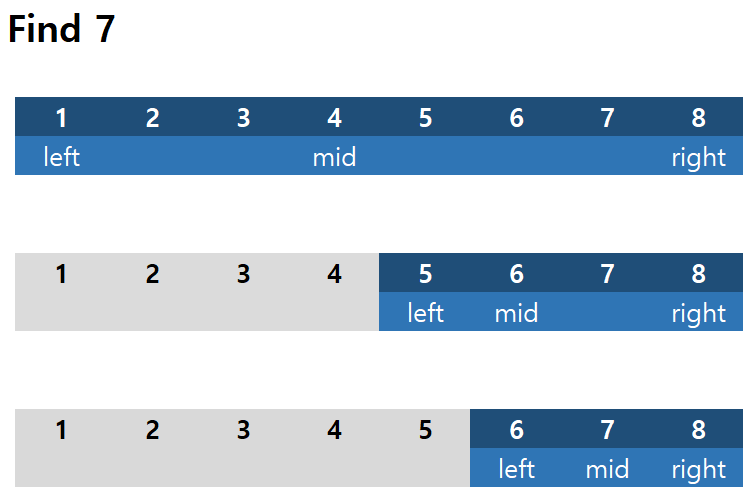
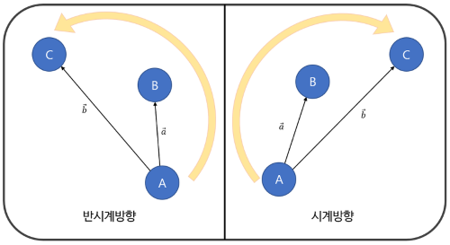

# 시간복잡도

[링크 참조](https://blog.chulgil.me/algorithm/)

위의 링크보다 더 잘 정리할 수는 없을 것 같다.  

  

# Binary search

이 방법은 이미 정렬되어 있는 데이터에만 적용 가능하다.  

데이터를 절반씩 계속 쪼개며 특정 조건을 만족하는 값을 찾는 것이 핵심이다.  

* `left` = 배열의 첫번째 인덱스  
* `right` = 배열의 마지막 인덱스  
* `mid` = 배열의 중간 인덱스  

1. `mid` 에 해당하는 값이 찾으려는 값과 같으면 break  

2. `mid` 에 해당하는 값이 찾으려는 값 보다 작으면  

   ```python
   left = mid + 1
   mid = int((left + right) / 2)
   ```

3. `mid` 값이 찾으려는 값 보다 크면  

   ```python
   right = mid - 1
   mid = int((left + right) / 2)
   ```

4. `1` 로 돌아가서 찾을때까지 반복한다.  

   

### 시각적으로 표현하면 다음과 같다.  




# CCW(CounterClockWise)

* 세 점의 정렬 방향을 판별한다.  
*  좌표평면상의 점 A(x1, y1), B(x2, y2), C(x3, y3) 에 대하여 벡터 a, b 가 다음 그림과 같이 정의된다고 하자  

  




​	벡터 a, b 의 외적의 z 성분을 D 라고 하면 다음이 성립한다.  

​		i) 점 A, B, C 가 차례로 반시계방향으로 배열되어 있을 때  

​			__*D*__ **> 0**  

​		ii) 점 A, B, C 가 일직선상에 있을 때   

​			__*D*__ **= 0**  

​		iii)점 A, B, C 가 차례대로 시계방향으로 배열되어 있을 때    

​			__*D*__ **< 0**  
​	
​	___D = (x2 - x1) * (y3 - y1) - (x3 - x1) * (y2 - y1)___  

​	_Hint: 벡터 a, b 의 x, y 성분을 이차정사각행렬로 나타내었을때의 행렬식을 구하면 된다._  


* 가장 대표적으로, 두 선분의 교점 존재 여부 판별에 사용한다. 이 경우 D = 0 일때 예외처리를 해야 할 경우가 생긴다.