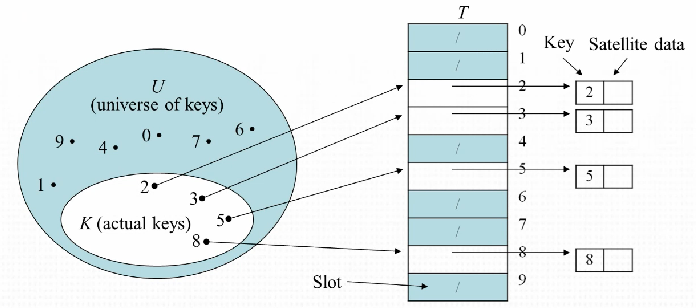
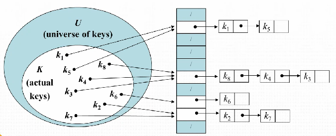

# 시간 복잡도

[링크 참조](https://blog.chulgil.me/algorithm/)

위의 링크보다 더 잘 정리할 수는 없을 것 같다.  

<br>

# Hash

### Direct-address tables

* 배열을 사용하여 레코드를 레코드에 대응되는 키와 매핑시킨 자료구조

* 크기가 U인 테이블 T를 생성한 뒤, `key k` 를 `slot k`에 저장한다
* `actual key K` 는 전체 `key U` 의 부분집합이다.



* 검색, 삽입, 삭제의 시간 복잡도는 O(1) 이다.
* 전체 레코드와 최대 크기가 다르면 메모리 낭비가 발생한다.
* 최대 키 값에 대한 정보가 있어야 한다.

  <br>

###  Hashing

* `key k` 를 저장할 떄 `slot k` 에 저장하는 것이 아니라 `slot h(k)` 에 저장한다. `h(k)` 는 `key k` 의 해쉬 값이고, `h()` 를 해쉬 함수리 한다.
* 해쉬 함수는 임의의 크기의 레코드를 고정된 크기의 레코드로 만든다.
* `h()` 함수에 따라 hash 충돌 문제가 발생할 수 있다. 이 경우 연결 리스트로 저장하여 충돌을 해결한다.




* 하지만 이 경우 긴 리스트를 만든다면 hash table 을 사용하는 이점이 없으므로 적절한 hash 함수를 사용하여야 한다.
* 사용 가능한 슬롯이 `m` 개라고 할 때 각각의 `key` 가 중복 없이 `m` 개의 슬롯으로 동일한 확률로 hash 되고, 다른 hash 값과 독립적으로 hash 되는 경우가 이상적인 경우이다.

<br>

# Binary search

이 방법은 이미 정렬되어 있는 데이터에만 적용 가능하다.  

데이터를 절반씩 계속 쪼개며 특정 조건을 만족하는 값을 찾는 것이 핵심이며 O(log N)의 시간 복잡도를 가진다.

* `left` = 배열의 첫번째 인덱스  
* `right` = 배열의 마지막 인덱스  
* `mid` = 배열의 중간 인덱스  

1. `mid` 에 해당하는 값이 찾으려는 값과 같으면 break  

2. `mid` 에 해당하는 값이 찾으려는 값 보다 작으면  

   ```python
   left = mid + 1
   mid = int((left + right) / 2)
   ```

3. `mid` 값이 찾으려는 값 보다 크면  

   ```python
   right = mid - 1
   mid = int((left + right) / 2)
   ```

4. `1` 로 돌아가서 찾을때까지 반복한다.  

   

### 시각적으로 표현하면 다음과 같다.  


<Br>

# CCW(CounterClockWise)

* 세 점의 정렬 방향을 판별한다.  
*  좌표평면상의 점 A(x1, y1), B(x2, y2), C(x3, y3) 에 대하여 벡터 a, b 가 다음 그림과 같이 정의된다고 하자  

  


​	벡터 a, b 의 외적의 z 성분을 D 라고 하면 다음이 성립한다.  

​		i) 점 A, B, C 가 차례로 반시계방향으로 배열되어 있을 때  

​			__*D*__ **> 0**  

​		ii) 점 A, B, C 가 일직선상에 있을 때   

​			__*D*__ **= 0**  

​		iii)점 A, B, C 가 차례대로 시계방향으로 배열되어 있을 때    

​			__*D*__ **< 0**  
​	
​	___D = (x2 - x1) * (y3 - y1) - (x3 - x1) * (y2 - y1)___  

* _D는 벡터 a, b 의 x, y 성분을 이차정사각행렬로 나타내었을때의 행렬식을 구하면 된다._
* _점 A, B, C 가 모두 제 1 사분면 위에 있을 때는 기울기의 대소 판별 개념으로 접근하여도 같은 식을 얻게 된다._  


* 가장 대표적으로, 두 선분의 교점 존재 여부 판별에 사용한다. 이 경우 D1 * D2  = 0 일때 예외처리를 해야 할 경우가 생긴다.