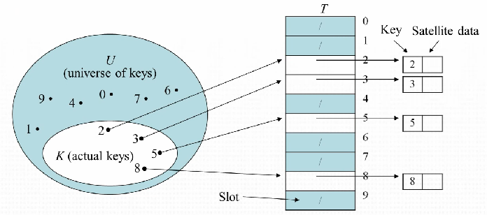
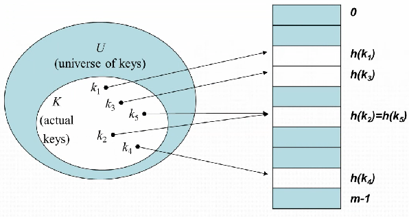
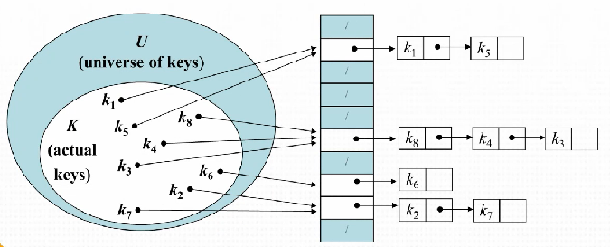

# 배열(Array)

* 여러 데이터를 하나의 이름으로 묶어 관리하기 위한 자료구조
  * value 와 index의 쌍으로 구성되어있다
  * index + value : element

 

# Hash table

### Direct-address table

* 배열을 사용하여 레코드를 레코드에 대응되는 키와 매핑시킨 자료구조

* 크기가 U인 테이블 T를 생성한 뒤, `key k` 를 `slot k`에 저장한다
* `actual key K` 는 전체 `key U` 의 부분집합이다.

* 검색, 삽입, 삭제의 시간 복잡도는 O(1) 이다.

* 전체 레코드와 최대 크기가 다르면 메모리 낭비가 발생한다.

* 최대 키 값에 대한 정보가 있어야 한다.

   

###  Hashing

* `key k` 를 저장할 떄 `slot k` 에 저장하는 것이 아니라 `slot h(k)` 에 저장한다. `h(k)` 는 `key k` 의 해쉬 값이고, `h()` 를 해쉬 함수라 한다.
* 해쉬 함수는 임의의 크기의 데이터를 고정된 크기의 데이터로 만든다.
* `h()` 함수에 따라 hash 충돌 문제가 발생할 수 있다. 이 경우 연결 리스트로 저장하여 충돌을 해결한다.

* 하지만 이 경우 긴 리스트를 만든다면 hash table 을 사용하는 이점이 없으므로 적절한 hash 함수를 사용하여야 한다.
* 사용 가능한 슬롯이 `m` 개라고 할 때 각각의 `key` 가 중복 없이 `m` 개의 슬롯으로 동일한 확률로 hash 되고, 다른 hash 값과 독립적으로 hash 되는 경우가 이상적인 경우이다.