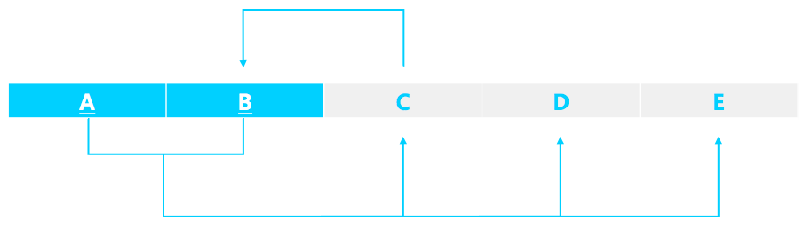

# 데이터베이스 정규화

다음 함수적 종속에서

> *X → Y*

* X는 결정자

* Y 는 종속자

* X가 Y 를 함수적으로 결정한다.

* Y가 X에 함수적으로 종속되어 있다.

     

1. 완전 함수적 종속

   > **속성집합 Y 가 속성집합 X 전체에 대해서만 함수적으로 종속되어있다.**
   
    예를 들어 완전 함수적 종속 관계인 두 속성집합 X, Y에 대하여
   
     X = {A, B}, Y = {M} 일때 {A, B} → {M} 를 만족하지만 {A} → {M} 와 같은 경우는 만족하지 않는다.   
   
   ​     
   
2. 부분 함수적 종속

   > **속성집합 Y 가 속성집합 X 의 일부분에도 함수적으로 종속되어있다.**
   
    예를 들어,
   
     X = {A, B}, Y = {M} 일때 {A, B} → {M} 를 만족하면서 {A} → {M} 또한 만족하는 경우
   
   부분 함수적 종속 관계이다. 

---

###  1.  제 1 정규형(1NF)

* 각 row 마다 column 의 값이 단 한개만 존재한다. 즉 column 이 원자값을 가진다.  

    

아래는 이를 만족하는 경우이다.

| name    | age  | language |
| ------- | ---- | -------- |
| Natalia | 40   | en       |
| Natalia | 40   | jp       |
| Ameline | 53   | en       |
| Vitalik | 26   | en       |

   

다음은 이를 만족하지 않는 경우이다.

| name    | age  | language |
| ------- | ---- | -------- |
| Natalia | 40   | en, jp   |
| Ameline | 53   | en       |
| Vitalik | 26   | en       |

​     

### 2. 제 2 정규형(2NF)

* 제 1 정규형에 속하면서
* 기본키가 아닌 모든 속성이 기본키에 완전 함수 종속된다.

만약 부분 함수적 충족이 나타난다면 릴레이션을 나누어 이를 해결하여야 한다.

​     

### 3. 제 3 정규형(3NF)

* 제 2 정규형에 속하면서

* 기본키가 아닌 모든 속성이 기본키에 이행적 함수 종속(Transitive Functional Dependency)이 되지 않아야 한다.

  >  둘 이상의 함수적 종속관계 연산으로 인해 나타나는 종속 관계를 이행적 함수 종속 관계라 한다.
  >
  > 예를 들어
  >
  > X → Y, Y → Z 의 관계로 인해 X → Z 의 관계가 나타날 경우 이를 이행적 함수 종속 관계라 한다.

이행적 함수 종속 관계가 나타난다면 릴레이션을 나누어 이를 해결한다.

위의 예시에서는 [X, Y], [Y, Z] 로 분리한다.

 

### 4. BCNF(Boyce_Codd Normal Form)

* X → Y 가 trivial FD 이거나

* X 가 릴레이션 R의 슈퍼 키 이면 BCNF를 만족한다.

* 즉, 모든 결정자가 key 인 경우에 bcnf를 만족한다.

  > trivial FD 는 Y 가 X의 부분집합인 경우이다.
  
   예를 들어,
  
A → A, AB → A 인 경우를 말한다.
  
   
  
  > 슈퍼 키는 릴레이션의 행을 고유하게 식별할 수 있는 속성의 집합을 말한다.
  
  후보 키는 위 조건을 만족하면서 속성의 중복이 없어 더 줄일 수 없는 슈퍼 키 이다.
  

* BCNF 를 만족하지 않는 릴레이션에 대한 분해과정은 다음과 같다.
  1. BCNF 를 위반하는 nontrivial FD X → Y 를 찾는다.
  2. 이를 XY로 구성된 릴레이션, X 와 나머지 속성들(Y를 제외한)로 구성된 릴레이션으로 분해한다.

 

아래는 BCNF 를 위반하는 대표적인 경우이다.

